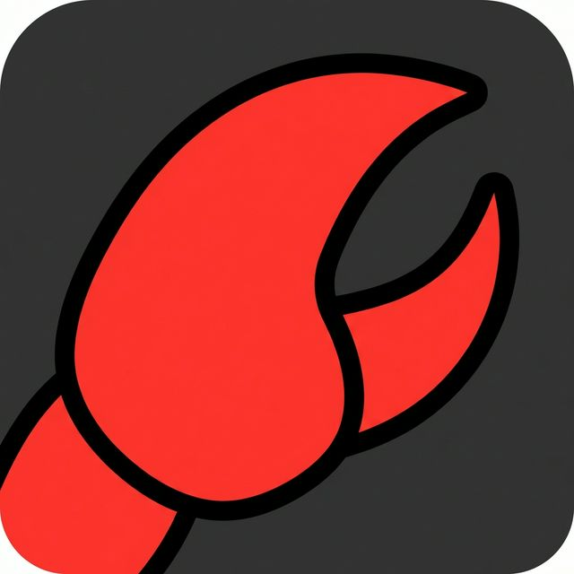

# OpenClaw for Raycast

<div align="center">



**OpenClaw Gateway 的原生 Raycast 客户端**

无缝集成 Raycast 体验 • 毫秒级流式响应 • 企业级安全认证

[](LICENSE)
[](https://developers.raycast.com)
[](https://www.typescriptlang.org/)
[](package.json)

</div>

---

## 📖 简介

**OpenClaw for Raycast** 是一款专为 Raycast 打造的高性能 AI 对话扩展。它通过 WebSocket 直接连接 OpenClaw Gateway，提供低延迟、流式传输的对话体验。

项目核心设计理念注重**性能**与**原生体验**。通过延迟渲染（Deferred Rendering）技术，即使在生成海量文本时也能保持界面 60fps 流畅运行；采用 Ed25519 签名机制，确保每一次交互都符合企业级安全标准。

## ✨ 核心特性

- **极致性能**：基于 WebSocket 长连接，首字延迟 <100ms。
- **流畅体验**：采用 Deferred Rendering 技术，彻底解决 Markdown 实时渲染导致的 UI 卡顿。
- **原生 UI**：
  - **Full Bleed 图标**：极具视觉冲击力的无边距设计。
  - **沉浸式对话**：左右两侧头像统一，支持 Markdown 富文本渲染。
- **无缝集成**：支持自动跟随、快捷键操作与系统级剪贴板联动。
- **安全认证**：内置 Ed25519 密钥对生成与管理，自动完成 Challenge-Response 握手。
- **智能交互**：支持流式思考状态（Thinking Process）展示，历史记录自动同步。
- **会话持久化**：本地存储设备身份，一次配对，长期有效。

## 📦 安装与部署

本扩展支持通过源码编译安装。

### 源码编译

```bash
git clone https://github.com/xiaotiyanlove-star/OpenClawForRaycast.git
cd OpenClawForRaycast
npm install && npm run build
```

编译完成后，使用 **Import Extension** 命令导入本项目根目录即可。

## ⚙️ 配置说明

首次使用前，请在 Raycast 设置（`⌘ ,` → Extensions → OpenClaw Chat）中完成以下配置：

| 配置项 | 描述 | 示例 |
| :--- | :--- | :--- |
| **Gateway URL** | OpenClaw Gateway 的 WebSocket 接入点 | `wss://api.openclaw.com` |
| **Gateway Token** | 具有 Operator 权限的认证令牌 | `eyJh...` |
| **Session Mode** | 会话隔离模式 | `Main Session (shared)` |

> [!TIP]
> **Session Mode 选择建议**：
> - **Shared** （推荐）：与其他客户端共享会话上下文，适合多设备同步场景。
> - **Independent**：独立会话，不与其他客户端共享上下文，适合需要隔离的场景。

## 🖥 使用指南

### 启动对话
唤出 Raycast，输入 `chat` 即可快速进入对话界面。

### 快捷操作
- **发送消息**：输入文本后按 `Enter`
- **停止生成**：`⌘ .`
- **重置会话**：`⌘ ⇧ R` (清空上下文)
- **清空历史**：`⌘ ⇧ Backspace` (仅清空本地显示)
- **复制内容**：`⌘ C`
- **查看历史**：向上滚动即可查看最近 50 条历史记录

### 连接状态
扩展内置了状态自检机制：
- 🟢 **Connected**：连接成功，随时待命
- 🟡 **Connecting**：正在建立 WebSocket 连接
- 🔴 **Error**：连接失败（通常为网络或 Token 问题）
- ⏳ **Pairing**：设备未认证，请在服务端批准配对请求
- ⚪ **Disconnected**：连接已断开（正常状态）

## 🔧 故障排查

### 1. Connection Error (1006)
- **原因**：Gateway 服务不可达或网络中断。
- **解决**：检查 `Gateway URL` 是否正确，确保能通过浏览器访问该地址。

### 2. Authentication Failed (401/403)
- **原因**：Token 无效或已过期。
- **解决**：重新生成 Token 并更新配置。

### 3. Pairing Stuck
- **现象**：一直显示 "等待配对"。
- **解决**：请联系管理员在 OpenClaw Control UI 中批准该设备的连接请求。批准后，扩展会自动重连。

### 4. Protocol Mismatch
- **现象**：连接报错 "Protocol version mismatch"。
- **解决**：请确保使用的 Gateway 服务端版本与客户端版本 (v3) 兼容。

## 🏗 技术架构

本项目采用纯 TypeScript 编写，核心模块设计如下：

- **Communication Layer**: `GatewayClient` 实现了完整的 RPC 协议封装与心跳保活机制。
- **Security Layer**: 基于 `node:crypto` 实现 Ed25519 签名，自动处理 `connect.challenge`。
- **Rendering Engine**: 实现了自定义的渲染调度器，在 `delta` 流式传输阶段使用占位符，仅在 `final` 阶段进行 Markdown 渲染，大幅降低 React Reconciliation 开销。
- **Asset Management**: 统一管理本地静态资源（图标、头像），支持不同环境路径解析。

## 📄 许可证

本项目基于 [MIT License](LICENSE) 开源。

## 👨‍💻 作者

<a href="https://github.com/xiaotiyanlove-star">
  
</a>

**xiaotiyan**